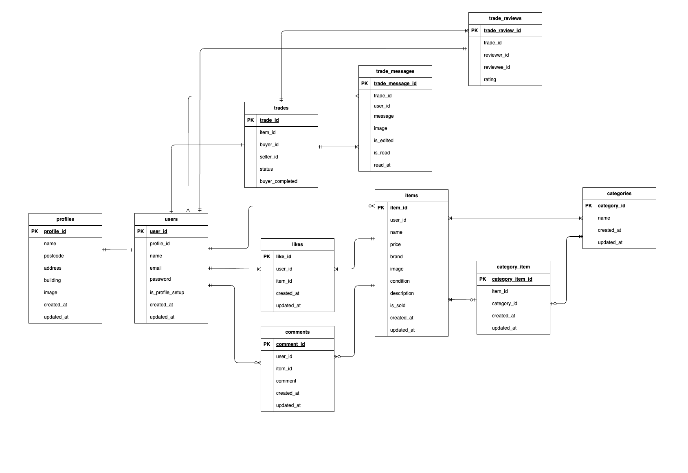

# FleaMarket

## 環境構築

### Dockerビルド

1.`git clone git@github.com:umemoto-11/FleaMarket.git`  
2.`docker-compose up -d --build`

### Laravel環境構築

1.docker-compose exec php bash  
2.composer install  
3..env.exampleファイルから.envを作成し、環境変数を変更  
4.php artisan key:generate  
5.php artisan migrate  
6.php artisan db:seed  
7.php artisan storage:link  

---

## 使用技術

・PHP 8.1  
・Laravel 8.83.8  
・MySQL 8.0  
・Stripe（決済機能）  
・Mailtrap（メール送信テスト）

---

###　環境変数設定例（.env）

```env  
# Stripe（テスト用キーは各自取得）
STRIPE_KEY=pk_test_xxxxxxxxxxxxx  
STRIPE_SECRET=sk_test_xxxxxxxxxxxxx

# Mailtrap（テスト用情報は各自取得）
MAIL_MAILER=smtp  
MAIL_HOST=sandbox.smtp.mailtrap.io  
MAIL_PORT=2525  
MAIL_USERNAME=xxxxxxxx  
MAIL_PASSWORD=xxxxxxxx  
MAIL_ENCRYPTION=null  
MAIL_FROM_ADDRESS="noreply@example.com"  
MAIL_FROM_NAME="${APP_NAME}"  
```

## ER図



## URL

・開発環境：http://localhost/  
・phpMyAdmin：http://localhost:8080/

## テストアカウント
name: 一般ユーザ  
email: user1@example.com  
password: password  
-------------------------
name: 一般ユーザ  
email: user2@example.com  
password: password  
-------------------------
name: 一般ユーザ  
email: user3@example.com  
password: password  
-------------------------

## 決済情報

**Stripeテストカード番号**
・成功:4242 4242 4242 4242  
※有効期限:未来の日付/CVC:任意の3桁

**Mailtrap**
・メールはMailtrapダッシュボードで確認可能

## PHPUnitを利用したテストに関して
以下のコマンド:  
```
//テスト用データベースの作成
docker-compose exec mysql bash
mysql -u root -p
//パスワードはrootと入力
create database test_database;

docker-compose exec php bash
php artisan migrate:fresh --env=testing
./vendor/bin/phpunit
```

## 備考
画像アップロードにstorage/app/publicを使用しています。
セットアップ後は、php artisan storage:linkコマンド実行が必須になっております。